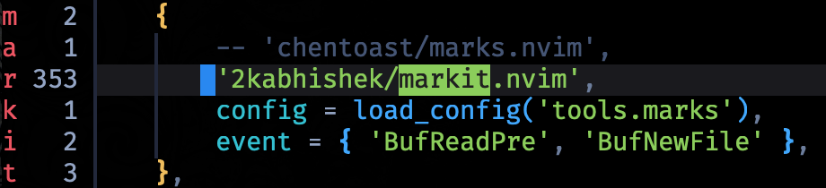

# markit.nvim

> This is a fork of [marks.nvim](https://github.com/chentoast/marks.nvim) with some fixes and improvements from the community.

A better user experience for interacting with and manipulating marks.



## Features

- view marks in the sign column
- add, delete, and toggle marks
- cycle between marks
- preview marks in floating windows
- extract marks to quickfix/location list
- set bookmarks with sign/virtual text annotations for quick navigation across buffers

## Installation

With lazy.nvim

```lua
    {
        -- 'chentoast/marks.nvim',
        '2kabhishek/markit.nvim',
        config = load_config('tools.marks'),
        event = { 'BufReadPre', 'BufNewFile' },
    },

```

## Setup

```lua
require'marks'.setup {
  -- whether to map keybinds or not. default true
  default_mappings = true,
  -- which builtin marks to show. default {}
  builtin_marks = { ".", "<", ">", "^" },
  -- whether movements cycle back to the beginning/end of buffer. default true
  cyclic = true,
  -- whether the shada file is updated after modifying uppercase marks. default false
  force_write_shada = false,
  -- how often (in ms) to redraw signs/recompute mark positions. 
  -- higher value means better performance but may cause visual lag,
  -- while lower value may cause performance penalties. default 150.
  refresh_interval = 150,
  -- sign priorities for each type of mark - builtin marks, uppercase marks, lowercase
  -- marks, and bookmarks.
  -- can be either a table with all/none of the keys, or a single number, in which case
  -- the priority applies to all marks.
  -- default 10.
  sign_priority = { lower=10, upper=15, builtin=8, bookmark=20 },
  -- disables mark tracking for specific filetypes. default {}
  excluded_filetypes = {},
  -- disables mark tracking for specific buftypes. default {}
  excluded_buftypes = {},
  -- marks.nvim allows you to configure up to 10 bookmark groups, each with its own
  -- sign/virttext. Bookmarks can be used to group together positions and quickly move
  -- across multiple buffers. default sign is '!@#$%^&*()' (from 0 to 9), and
  -- default virt_text is "".
  bookmark_0 = {
    sign = "⚑",
    virt_text = "hello world",
    -- explicitly prompt for a virtual line annotation when setting a bookmark from this group.
    -- defaults to false.
    annotate = false,
  },
  mappings = {}
}
```

### Builtin Marks
The `builtin_marks` option allows you to track and show vim's builtin marks in the sign column. These marks will update automatically when the cursor moves.

Supported builtin marks:
- `"'"` - Last jump
- `"^"` - Last insertion stop position
- `"."` - Last change
- `"<"` - Start of last visual selection
- `">"` - End of last visual selection

### Bookmarks
Bookmarks are unnamed markers tied to a particular (buffer, line, col) triple. Unlike regular marks, bookmarks can have signs or virtual text annotations attached to them. They are useful for remembering positions across buffers without using uppercase marks.

For example, you might set two bookmarks to quickly toggle back and forth between a function and its corresponding unit test in another file.

markit.nvim supports up to 10 bookmark groups (0-9), each with its own optional sign text and virtual text annotations.

## Mappings

The following default mappings are included:

```
    mx              Set mark x
    m,              Set the next available alphabetical (lowercase) mark
    m;              Toggle the next available mark at the current line
    dmx             Delete mark x
    dm-             Delete all marks on the current line
    dm<space>       Delete all marks in the current buffer
    m]              Move to next mark
    m[              Move to previous mark
    m:              Preview mark. This will prompt you for a specific mark to
                    preview; press <cr> to preview the next mark.
    Mx              Toggle mark x
    m[0-9]          Add a bookmark from bookmark group[0-9].
    dm[0-9]         Delete all bookmarks from bookmark group[0-9].
    m}              Move to the next bookmark having the same type as the bookmark under
                    the cursor. Works across buffers.
    m{              Move to the previous bookmark having the same type as the bookmark under
                    the cursor. Works across buffers.
    dm=             Delete the bookmark under the cursor.
```

Set `default_mappings = false` in the setup function if you don't want to have these mapped.

You can change the keybindings by setting the `mapping` table in the setup function:

```lua
require'marks'.setup {
    mappings = {
        set = 'M',
        toggle_mark = 'm',
        set_next = false -- pass false to disable only this default mapping
    },
}
```

The following keys are available to be passed to the mapping table:

```
  set_next               Set next available lowercase mark at cursor.
  toggle                 Toggle next available mark at cursor.
  toggle_mark            Toggle a mark at the current line.
  delete_line            Deletes all marks on current line.
  delete_buf             Deletes all marks in current buffer.
  next                   Goes to next mark in buffer.
  prev                   Goes to previous mark in buffer.
  preview                Previews mark (will wait for user input). press <cr> to just preview the next mark.
  set                    Sets a letter mark (will wait for input).
  delete                 Delete a letter mark (will wait for input).

  set_bookmark[0-9]      Sets a bookmark from group[0-9].
  delete_bookmark[0-9]   Deletes all bookmarks from group[0-9].
  delete_bookmark        Deletes the bookmark under the cursor.
  next_bookmark          Moves to the next bookmark having the same type as the
                         bookmark under the cursor.
  prev_bookmark          Moves to the previous bookmark having the same type as the
                         bookmark under the cursor.
  next_bookmark[0-9]     Moves to the next bookmark of the same group type. Works by
                         first going according to line number, and then according to buffer
                         number.
  prev_bookmark[0-9]     Moves to the previous bookmark of the same group type. Works by
                         first going according to line number, and then according to buffer
                         number.
  annotate               Prompts the user for a virtual line annotation that is then placed
                         above the bookmark. Requires neovim 0.6+ and is not mapped by default.
```

marks.nvim also provides a list of lua APIs for you, which can be used to setup mappings, here's what my config with which key looks like:

```lua
    m = {
        name = icons.ui.Bookmark .. 'Marks',
        b = { "<cmd>lua require('telescope').extensions.marks_nvim.bookmarks_list_all()<cr>", 'Bookmarks' },
        d = { "<cmd>lua require('marks').delete_line()<cr>", 'Delete Line' },
        D = { "<cmd>lua require('marks').delete_buf()<cr>", 'Delete Buffer' },
        h = { "<cmd>lua require('marks').prev_bookmark()<cr>", 'Previous Bookmark' },
        j = { "<cmd>lua require('marks').next()<cr>", 'Next' },
        k = { "<cmd>lua require('marks').prev()<cr>", 'Previous' },
        l = { "<cmd>lua require('marks').next_bookmark()<cr>", 'Next Bookmark' },
        m = { '<cmd>Telescope marks<cr>', 'All Marks' },
        P = { "<cmd>lua require('marks').preview()<cr>", 'Preview' },
        s = { "<cmd>lua require('marks').set_next()<cr>", 'Set Next' },
        t = { "<cmd>lua require('marks').toggle()<cr>", 'Toggle' },
        x = { "<cmd>lua require('marks').delete_bookmark()<cr>", 'Delete Bookmark' },

        ['1'] = { "<cmd>lua require('marks').toggle_bookmark1()<cr>", 'Toggle Bookmark 0' },
        ['2'] = { "<cmd>lua require('marks').toggle_bookmark2()<cr>", 'Toggle Bookmark 2' },
        ['3'] = { "<cmd>lua require('marks').toggle_bookmark3()<cr>", 'Toggle Bookmark 3' },
        ['4'] = { "<cmd>lua require('marks').toggle_bookmark4()<cr>", 'Toggle Bookmark 4' },

        n = {
            name = 'Next Bookmark Group',
            ['1'] = { "<cmd>lua require('marks').next_bookmark1()<cr>", 'Next Bookmark 1' },
            ['2'] = { "<cmd>lua require('marks').next_bookmark2()<cr>", 'Next Bookmark 2' },
            ['3'] = { "<cmd>lua require('marks').next_bookmark3()<cr>", 'Next Bookmark 3' },
            ['4'] = { "<cmd>lua require('marks').next_bookmark4()<cr>", 'Next Bookmark 4' },
        },

        p = {
            name = 'Previous Bookmark Group',
            ['1'] = { "<cmd>lua require('marks').prev_bookmark1()<cr>", 'Previous Bookmark 1' },
            ['2'] = { "<cmd>lua require('marks').prev_bookmark2()<cr>", 'Previous Bookmark 2' },
            ['3'] = { "<cmd>lua require('marks').prev_bookmark3()<cr>", 'Previous Bookmark 3' },
            ['4'] = { "<cmd>lua require('marks').prev_bookmark4()<cr>", 'Previous Bookmark 4' },
        },
    },
```

See `:help marks-mappings` for more information.

## Telescope

There's a telescope extension allowing to list marks through telescope.

To activate it you need to load the extension:

```lua
local telescope = require("telescope")

telescope.load_extension("marks_nvim")
```

You can then use the extension methods to list marks instead of using the native loclist system.
You need to call these methods in your mappings.

```lua
require('telescope').extensions.marks_nvim.marks_list_buf(opts) -- List buffer marks
require('telescope').extensions.marks_nvim.marks_list_all(opts) -- List all marks
require('telescope').extensions.marks_nvim.bookmarks_list_group(1, opts) -- List a bookmark group marks (takes the group number as  argument)
require('telescope').extensions.marks_nvim.bookmarks_list_all(opts) -- List all bookmarks marks
```

These methods will use your `path_display` telescope configuraiton to display paths.
You can also pass a specific property for one method in the `opts` table.

```lua
require('telescope').extensions.marks_nvim.marks_list_all({ path_display = 'shorten' })
```

## Highlights

marks.nvim defines the following highlight groups:

`MarkSignHL` The highlight group for displayed mark signs.

`MarkSignNumHL` The highlight group for the number line in a signcolumn.

`MarkSignLineHL` The highlight group for the whole line the sign is placed in.

`MarkVirtTextHL` The highlight group for bookmark virtual text annotations.

## Commands

marks.nvim also defines the following commands:

`:MarksToggleSigns[ buffer]` Toggle signs globally. Also accepts an optional
buffer number to toggle signs for that buffer only.

`:MarksListBuf` Fill the location list with all marks in the current buffer.

`:MarksListGlobal` Fill the location list with all global marks in open buffers.

`:MarksListAll` Fill the location list with all marks in all open buffers.

`:BookmarksList group_number` Fill the location list with all bookmarks of group "group_number".

`:BookmarksListAll` Fill the location list with all bookmarks, across all groups.

There are also corresponding commands for those who prefer the quickfix list:

`:MarksQFListBuf`

`:MarksQFListGlobal`

`:MarksQFListAll`

`:BookmarksQFList group_number`

`:BookmarksQFListAll`

## Todos

- [ ] Better telescope previews
- [ ] Custom notes for bookmarks
- [ ] Export bookmarks as markdown

## See Also

[vim-signature](https://github.com/kshenoy/vim-signature)

[vim-bookmarks](https://github.com/MattesGroeger/vim-bookmarks)
